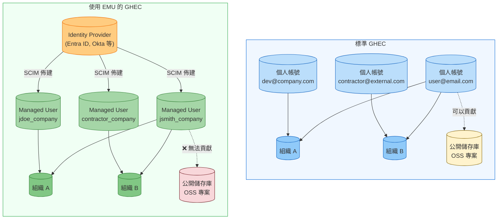
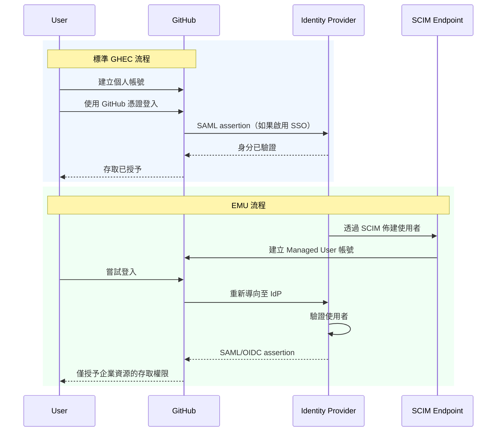

# 遷移至 GitHub Enterprise Managed Users 完整指南 - 第 1 部分：探索與決策

> **📚 系列：遷移至 GitHub Enterprise Managed Users 完整指南**
> 這是 EMU 遷移指南系列的**第 1 部分，共 6 部分**。
>
> | 部分 | 主題 |
> |------|------|
> | **[第 1 部分：探索與決策](Part1-Discovery&Decision.md)**（您在此處）| 定義目標、評估適用性、取得共識 |
> | [第 2 部分：遷移前準備](Part2-Pre-MigrationPreparation.md) | 盤點、清理、IdP 準備、使用者溝通 |
> | [第 3 部分：身分識別與存取設定](Part3-Identity&Access%20Setup.md) | 設定 SCIM、佈建使用者、建立團隊 |
> | [第 4 部分：安全性與合規性](Part4-Security&Compliance.md) | 稽核記錄、安全強化、CI/CD、整合 |
> | [第 5 部分：遷移執行](Part5-MigrationExecution.md) | 執行 GEI、遷移儲存庫  |
> | [第 6 部分：驗證與採用](Part6-Validation&Adoption.md) | 測試、使用者培訓、OSS 策略、正式上線 |

---

# 第 1 階段：探索與決策
遷移前目標環境選用與決策

## 為什麼要遷移至 EMU？

### 常見遷移目標

**安全性與風險降低**
- 消除程式碼洩漏到公開儲存庫的風險
- 確保員工離職時立即撤銷存取權限
- 透過集中式稽核記錄掌握所有開發者活動
- 一致地強制執行企業身分驗證政策

**合規性與治理**
- 滿足身分管理的法規要求（SOC 2、HIPAA、FedRAMP）
- 回應稽核人員對集中式存取控制證據的要求
- 實施資料駐留控制以符合地理合規要求
- 透過角色型存取展示職責分離

**營運效率**
- 透過 SCIM 自動化減少手動帳號管理負擔
- 將身分管理整合至現有的 IdP 基礎架構
- 透過群組型權限簡化存取審查和認證
- 透過自動化佈建縮短新進人員的生產力就緒時間

**成本最佳化**
- 透過自動化取消佈建來改善授權管理
- 減少因自助帳號問題產生的支援負擔
- 透過集中管理打造更乾淨的企業架構

## 什麼是 Enterprise Managed Users？

Enterprise Managed Users 是 GitHub 為需要集中身分管理的組織提供的解決方案。與標準 GHEC 中使用者自行建立和管理個人帳號不同，EMU 讓你的組織完全控制使用者生命週期：

- **你的 IdP 佈建使用者帳號**到 GitHub，使其可以存取你的企業
- **使用者透過你的 Identity Provider 進行身分驗證**，使用 SAML 或 OIDC
- **你從 IdP 控制使用者名稱、個人資料資料、組織成員資格和儲存庫存取**
- **使用者帳號根據 IdP 變更自動建立、更新和停用**

可以把它想像成「自帶裝置」和「公司配發筆電」之間的差異。兩者都可以運作，但它們服務於不同的安全性和合規性需求。

完整介紹請參閱 GitHub 官方文件 [About Enterprise Managed Users](https://docs.github.com/en/enterprise-cloud@latest/admin/identity-and-access-management/understanding-iam-for-enterprises/about-enterprise-managed-users)。

## 何時應該使用 EMU？

### 使用 EMU 的理由

**1. 合規性和法規要求**

如果你屬於受監管的行業（金融、醫療、政府、國防），EMU 提供了稽核人員所需之必要控制：
- 從單一事實來源進行完整的使用者生命週期管理
- 員工離職時自動取消佈建（不再有孤立帳號）
- 所有身分相關操作的完整稽核軌跡
- 透過企業 IdP 強制執行身分驗證

**2. 資料外洩防護 (DLP)**

EMU 的限制對於重視安全的組織來說是功能，而非缺陷：
- 使用者無法意外（或故意）將公司程式碼推送到公開儲存庫
- 沒有公開的 gists 可能讓敏感片段外洩
- 所有工作都保留在企業邊界內
- 防止開發者使用個人帳號進行工作的「影子 IT」情境

**3. 真正的 Single Sign-On 體驗**

與標準 GHEC 中 SAML 將外部身分連結到個人帳號不同，EMU 提供真正的 SSO：
- 使用者透過 IdP 進行一次身分驗證
- 無需管理額外的 GitHub 密碼
- Conditional Access Policies（使用 OIDC/Entra ID）支援位置、裝置合規性和風險型存取
- Session 管理直接與 IdP 綁定

**4. 集中式身分治理**

如果你的組織已大量投資於身分管理：
- 使用者屬性從 IdP 自動流入
- 透過 IdP 群組進行群組型存取管理
- 跨所有系統一致的命名慣例
- 在一個地方管理存取審查和認證

**5. 承包商和供應商管理**

EMU 的 Guest Collaborator 角色非常適合外部人員：
- 授予臨時存取權限而無需建立永久帳號
- 承包商合約結束時自動移除
- 明確區分正職員工和外部協作者
- 所有外部存取的稽核軌跡

**6. 資料駐留要求**

如果你需要控制資料儲存的位置，具有資料駐留功能的 GitHub Enterprise Cloud（在 GHE.com 上）**需要** EMU。這對於以下組織至關重要：
- 歐盟資料主權要求
- 政府資料處理規定
- 特定行業的地理限制

### 不使用 EMU 的理由

**1. 大量開源參與**

如果你的公司積極貢獻開源專案：
- Managed Users 無法貢獻企業外的儲存庫
- 無法建立公開儲存庫意味著無法在 GitHub 上託管自己的 OSS 專案
- 開發者需要另外的個人帳號來進行外部貢獻
- 切換帳號的認知負擔是真實且煩人的

**2. 開發者招募和社群建設**

貢獻圖表對某些組織很重要：
- Managed User 的貢獻不會出現在公開個人資料上
- 你無法透過 EMU 帳號展示團隊的開源工作
- 開發者倡導和社群參與變得更複雜

**3. 小型團隊或新創公司**

如果以下情況成立，額外負擔可能不值得：
- 開發者人數少於 50-100 人
- IdP 基礎架構尚不成熟
- 需要靈活性勝過控制
- 快速入職比治理更重要

**4. 學術或研究機構**

當協作是主要目標時：
- 研究人員需要跨機構邊界進行協作
- 通常要求公開發布程式碼
- 學生帳號頻繁進出
- 「圍牆花園」模式與學術開放性衝突

**5. 顧問或代理工作**

如果你的開發者在客戶的儲存庫工作：
- Managed Users 只能存取企業內的儲存庫
- 客戶工作通常發生在客戶的 GitHub 組織中
- 這些限制會對面向客戶的工作造成摩擦

### 決策框架

問自己這些問題：

| 問題 | 若是 | 若否 |
|------|------|------|
| 我們有嚴格的合規要求嗎？ | EMU | 皆可 |
| 開發者需要貢獻外部 OSS 嗎？ | 標準 GHEC | EMU |
| 我們的 IdP 是所有存取的唯一事實來源嗎？ | EMU | 皆可 |
| 我們需要資料駐留控制嗎？ | EMU | 皆可 |
| 開發者在客戶儲存庫工作嗎？ | 標準 GHEC | 皆可 |
| 防止資料外洩是最優先事項嗎？ | EMU | 皆可 |

## 比較 GHEC 和 GHEC-EMU

### 架構差異

### 身分識別與驗證流程比較

### 功能比較矩陣

| 功能 | 標準 GHEC | GHEC-EMU |
|------|-----------|----------|
| 使用者帳號建立 | 使用者自助服務 | 僅透過 IdP 佈建 |
| 使用者名稱格式 | 使用者自選 | `handle_shortcode` 格式 |
| 建立公開儲存庫 | 是 | 否 |
| 公開 Gists | 是 | 否 |
| 貢獻外部儲存庫 | 是 | 否 |
| GitHub Pages（公開） | 是 | 有限制 |
| GitHub Copilot Free/Pro | 是 | 否（需要 Business/Enterprise） |
| Conditional Access Policy | 有限 | 完整支援（使用 OIDC） |
| 使用者生命週期管理 | 手動 | 透過 SCIM 自動化 |
| Identity Provider | 選用 | 必要 |

完整限制清單請參閱 [Abilities and restrictions of managed user accounts](https://docs.github.com/en/enterprise-cloud@latest/admin/identity-and-access-management/understanding-iam-for-enterprises/abilities-and-restrictions-of-managed-user-accounts)。

---

> **📚 EMU 遷移指南系列導覽**
>
> ➡️ **下一篇：[第 2 部分 - 遷移前準備](Part2-Pre-MigrationPreparation.md)**
>
> ---

