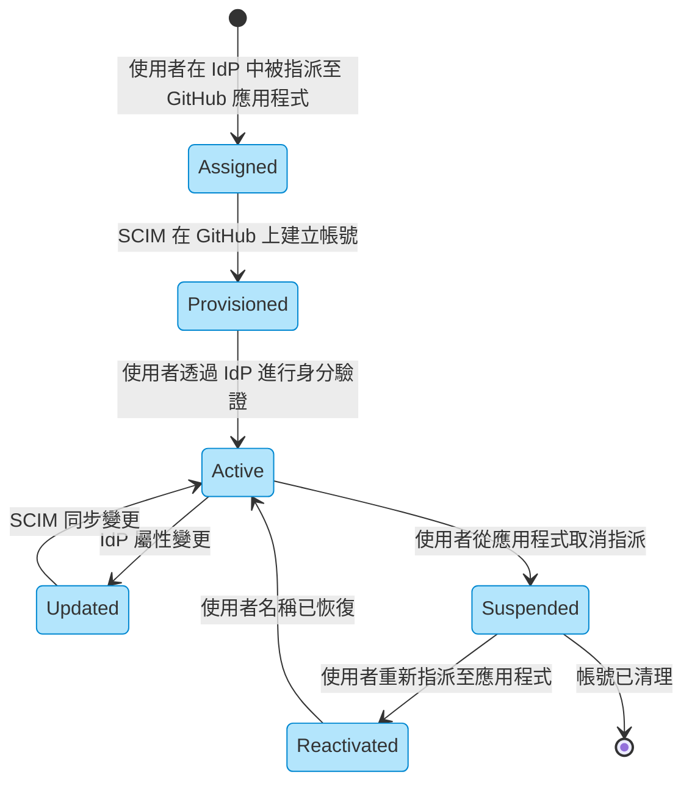
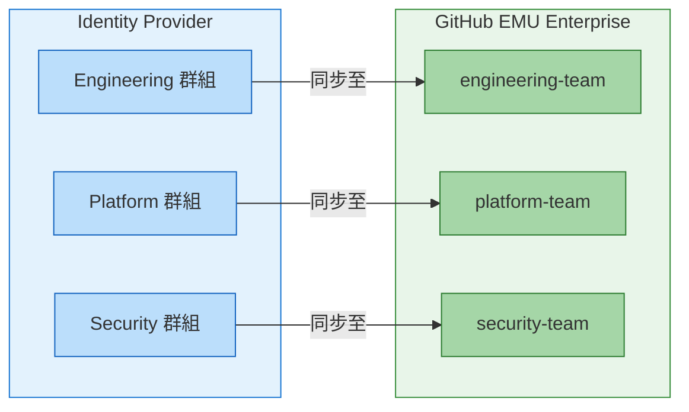

# 遷移至 GitHub Enterprise Managed Users 完整指南 - 第 3 部分：身分識別與存取設定

> **📚 系列：遷移至 GitHub Enterprise Managed Users 完整指南**
> 這是 EMU 遷移指南系列的**第 3 部分，共 6 部分**。
>
> | 部分 | 主題 |
> |------|------|
> | [第 1 部分：探索與決策](Part1-Discovery&Decision.md) | 定義目標、評估適用性、取得共識 |
> | [第 2 部分：遷移前準備](Part2-Pre-MigrationPreparation.md) | 盤點、清理、IdP 準備、使用者溝通 |
> | **[第 3 部分：身分識別與存取設定](Part3-Identity&Access%20Setup.md)**（您在此處）| 設定 SCIM、佈建使用者、建立團隊 |
> | [第 4 部分：安全性與合規性](Part4-Security&Compliance.md) | 稽核記錄、安全強化、CI/CD、整合 |
> | [第 5 部分：遷移執行](Part5-MigrationExecution.md) | 執行 GEI、遷移儲存庫 |
> | [第 6 部分：驗證與採用](Part6-Validation&Adoption.md) | 測試、使用者培訓、OSS 策略、正式上線 |

---

# 第 3 階段：身分識別與存取設定

*在遷移前設定新的環境。*

在你遷移儲存庫之前，你需要有使用者來指派權限。這個階段涵蓋設定 IdP 整合、透過 SCIM 佈建使用者，以及建立團隊結構。先把這些做對——它會讓其他一切更順暢。

## 身分識別與使用者生命週期管理

這是 EMU 真正閃耀的地方，但如果沒有正確設定，也是最容易出問題的地方。

### 使用者名稱正規化

GitHub 會透過正規化 IdP 中的識別碼來自動建立使用者名稱。格式為：

```
{normalized_handle}_{enterprise_shortcode}
```

例如，如果你的企業簡碼是 `acme`，而 IdP 提供的是 `John.Smith@company.com`，使用者名稱可能會變成 `john-smith_acme`。

請注意：
- 特殊字元會被移除或替換
- 正規化後的名稱可能發生衝突
- 在 IdP 中變更使用者的電子郵件將會取消對貢獻歷史的連結
- 避免使用任何類型的隨機產生數字或 ID 作為使用者名稱的一部分。這看似是處理名稱衝突的簡單方式，但如果使用者記錄中有任何更新，SCIM 將會重新處理使用者物件和所有表達式。簡而言之，如果你使用 `rand()`，你的使用者名稱會變更，你的使用者會有不好的體驗⋯⋯

請參閱 [Username considerations for external authentication](https://docs.github.com/en/enterprise-cloud@latest/admin/identity-and-access-management/managing-iam-for-your-enterprise/username-considerations-for-external-authentication) 了解正規化規則。

### SCIM Provisioning 生命週期

正確設定 SCIM 後，使用者生命週期是完全自動化的：



### 團隊與權限同步

在 EMU 中，團隊成員資格是透過 IdP 的群組同步來管理的。這是與標準 GHEC（直接在 GitHub 中管理團隊成員資格）的根本性轉變。

#### 團隊同步的運作方式



當你將 IdP 群組連接到 GitHub 團隊時：
- IdP 群組中的使用者會自動被加入 GitHub 團隊
- 從 IdP 群組移除的使用者會自動從 GitHub 團隊移除
- 變更通常在幾分鐘內傳播
- 在 GitHub 中手動更改團隊成員資格會在下次同步時被覆蓋

#### 設定團隊同步

**步驟 1：建立 GitHub 團隊**

```bash
# Create a new team in your organization
gh api orgs/YOUR_ORG/teams \
  -X POST \
  -f name="platform-team" \
  -f description="Platform engineering team" \
  -f privacy="closed"
```

**步驟 2：連接 IdP 群組**

在 GitHub UI 中：
1. 導覽至你的組織 → Teams → 選擇團隊
2. 點選「Settings」→「Identity Provider Groups」
3. 搜尋並選擇要連接的 IdP 群組
4. 儲存變更

或透過 API：

```bash
# Connect an IdP group to a team
# You'll need the group's IdP identifier
gh api orgs/YOUR_ORG/teams/TEAM_SLUG/team-sync/group-mappings \
  -X PATCH \
  -f "groups[][group_id]=YOUR_IDP_GROUP_ID" \
  -f "groups[][group_name]=Your IdP Group Name" \
  -f "groups[][group_description]=Group description"
```

#### 團隊結構規劃

在遷移前，規劃你的 IdP 群組如何連接到 GitHub 團隊：

| IdP 群組 | GitHub 團隊 | 儲存庫存取 | 權限等級 |
|----------|-------------|-----------|----------|
| `eng-backend` | `backend-developers` | `api-services/*` | Write |
| `eng-frontend` | `frontend-developers` | `web-app/*` | Write |
| `eng-platform` | `platform-team` | `infrastructure/*` | Admin |
| `eng-leads` | `tech-leads` | 所有儲存庫 | Maintain |
| `security-team` | `security-reviewers` | 所有儲存庫 | Read + Security alerts |

**關鍵考量：**

1. **一對一還是一對多？** 每個 GitHub 團隊只能連接到一個 IdP 群組。但一個 IdP 群組在需要時可以連接到多個 GitHub 團隊。

2. **巢狀團隊**：GitHub 支援巢狀團隊，但 IdP 群組連接只適用於直接連接的團隊。子團隊不會繼承群組連接。

3. **命名慣例**：建立在兩個系統中都適用的明確命名慣例。考慮在 IdP 中使用如 `gh-` 的前綴來識別與 GitHub 相關的群組。

4. **權限繼承**：團隊授予儲存庫權限。規劃你的團隊層級結構以符合存取控制需求。

#### 常見陷阱

**❌ 問題：手動將使用者加入已同步的團隊**

手動加入啟用了 IdP 同步的團隊的使用者，將會在下次同步週期被移除。所有成員資格必須透過 IdP 群組進行。

**❌ 問題：遷移後的孤立團隊**

如果你遷移了團隊但沒有將它們連接到 IdP 群組，它們將不會有成員（因為 EMU 使用者只能透過 IdP 同步加入團隊）。

**❌ 問題：太多小型群組**

在每個儲存庫和 IdP 群組之間建立 1:1 對應將導致 IdP 中的群組蔓延。在適當的地方使用團隊層級結構和更廣泛的存取模式。

**✅ 解決方案：規劃你的群組策略**

```
IdP 群組策略：
├── 廣泛存取群組（大多數使用者）
│   ├── all-developers（大多數儲存庫的讀取權限）
│   └── all-engineers（團隊儲存庫的寫入權限）
├── 團隊專用群組
│   ├── team-api
│   ├── team-web
│   └── team-mobile
└── 特權存取群組
    ├── repo-admins
    └── security-team
```

#### 驗證團隊同步

設定完成後，驗證同步是否運作：

```bash
# List team members (should match IdP group)
gh api orgs/YOUR_ORG/teams/TEAM_SLUG/members --jq '.[].login'

# Check team sync status
gh api orgs/YOUR_ORG/teams/TEAM_SLUG/team-sync/group-mappings
```

請參閱 [Managing team memberships with identity provider groups](https://docs.github.com/en/enterprise-cloud@latest/admin/identity-and-access-management/using-enterprise-managed-users-for-iam/managing-team-memberships-with-identity-provider-groups) 取得完整文件。

---

> **📚 EMU 遷移指南系列導覽**
>
> ⬅️ **上一篇：[第 2 部分 - 遷移前準備](Part2-Pre-MigrationPreparation.md)**
> ➡️ **下一篇：[第 4 部分 - 安全性與合規性](Part4-Security&Compliance.md)**
>
> ---
> *這是遷移至 GitHub Enterprise Managed Users 六部分系列的第 3 部分。覺得有幫助？給個 👍 並與你的團隊分享！有問題或我遺漏了什麼？請在下方留言。*
