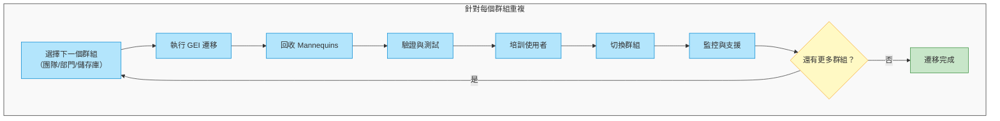

# 遷移至 GitHub Enterprise Managed Users 完整指南 - 第 5 部分：遷移執行

> **📚 系列：遷移至 GitHub Enterprise Managed Users 完整指南**
> 這是 EMU 遷移指南系列的**第 5 部分，共 6 部分**。
>
> | 部分 | 主題 |
> |------|------|
> | [第 1 部分：探索與決策](Part1-Discovery&Decision.md) | 定義目標、評估適用性、取得共識 |
> | [第 2 部分：遷移前準備](Part2-Pre-MigrationPreparation.md) | 盤點、清理、IdP 準備、使用者溝通 |
> | [第 3 部分：身分識別與存取設定](Part3-Identity&Access-Setup.md) | 設定 SCIM、佈建使用者、建立團隊 |
> | [第 4 部分：安全性與合規性](Part4-Security&Compliance.md)  | 稽核記錄、安全強化、整合 |
> | **[第 5 部分：遷移執行](Part5-MigrationExecution.md)**（您在此處）| 執行 GEI、遷移儲存庫 |
> | [第 6 部分：驗證與採用](Part6-Validation&Adoption.md) | 測試、使用者培訓、OSS 策略、正式上線 |

---

# 第 5 階段：遷移執行

在安全政策就位且使用者已佈建之後即可開始遷移，這個階段是反覆執行的——需要針對每個團隊或儲存庫群組重複執行。從一個試驗群組開始，從經驗中學習，然後擴展。

## 遷移迴圈



## GitHub 遷移工具

GitHub 提供了多種遷移工具，取決於來源平台

### GitHub Enterprise Importer (GEI)

[GitHub Enterprise Importer](https://docs.github.com/en/migrations/using-github-enterprise-importer/understanding-github-enterprise-importer/about-github-enterprise-importer) 是高保真遷移的主要工具。它支援：

- **Azure DevOps Cloud** 到 GHEC
- **Bitbucket Server/Data Center 5.14+** 到 GHEC
- **GitHub.com** 到 GHEC
- **GitHub Enterprise Server 3.4.1+** 到 GHEC

主要功能：
- 逐儲存庫或逐組織的遷移
- 保留 Git 歷史和 GitHub Metadata（Issues、PRs 等）
- 清晰的錯誤記錄，不會因非關鍵問題而阻塞
- 使用者保留其歷史的擁有權

透過 GitHub CLI 安裝和使用 GEI：

```bash
# Install the GEI extension
gh extension install github/gh-gei

# For GHEC to GHEC migration
gh gei migrate-repo \
  --github-source-org SOURCE_ORG \
  --source-repo REPO_NAME \
  --github-target-org TARGET_ORG \
  --target-repo REPO_NAME

# For organization migration
gh gei migrate-org \
  --github-source-org SOURCE_ORG \
  --github-target-org TARGET_ORG \
  --github-target-enterprise TARGET_ENTERPRISE
```

### 處理 Mannequins

當你使用 GEI 遷移時，使用者活動（除 Git commits 外）會被連結到稱為 **Mannequins** 的佔位身分。每個 Mannequin 只有顯示名稱（來自來源儲存庫），沒有組織成員資格或儲存庫存取權限。遷移後，需要回收（reclaim）這些 Mannequins，將它們的歷史歸屬到真正的組織成員帳號

> **注意事項：**
> - 回收 Mannequins 是**選擇性**的，可在遷移完成後任何時間執行，不會阻擋團隊開始使用已遷移的儲存庫
> - 將儲存庫轉移至其他組織**之後**，就無法再回收 Mannequins，必須在轉移前完成
> - 只能將 Mannequins 歸屬給**已經是組織成員**的使用者
> - GEI 不會遷移使用者的儲存庫存取權限，回收 Mannequins 後仍需透過團隊成員資格另外授予存取權

- 完整文件請參閱 [Reclaiming mannequins for GitHub Enterprise Importer](https://docs.github.com/en/migrations/using-github-enterprise-importer/completing-your-migration-with-github-enterprise-importer/reclaiming-mannequins-for-github-enterprise-importer)

#### 方法一：使用 GitHub CLI 回收

適用於 GHEC 到 GHEC 遷移，使用 GEI 擴充套件：

- 批次回收（Bulk reclaim）：

  1. 產生 Mannequin CSV 對應檔：

      ```bash
      gh gei generate-mannequin-csv --github-target-org TARGET_ORG --output mannequins.csv
      ```

  2. 編輯 CSV 檔案，為每個 Mannequin 填入對應的組織成員使用者名稱，然後儲存
      ```
      mannequin-user,mannequin-id,target-user
      tom123,M_kgDOEFTa0Q,tom_octo
      marry456,M_kgDOEFTa0w,marry_octo
      ```

  3. 執行批次回收：
      ```bash
      gh gei reclaim-mannequin --github-target-org TARGET_ORG --csv mannequins.csv
      ```

- 個別回收（Individual reclaim）：
  ```bash
  # reclaim a single mannequin by specifying the mannequin login and target user
  gh gei reclaim-mannequin \
    --github-target-org TARGET_ORG \
    --mannequin-user MANNEQUIN_LOGIN \
    --target-user USERNAME
  ```

> 如果有多個相同登入名稱的 Mannequins，可使用 `--mannequin-id ID` 取代 `--mannequin-user`
> 若組織使用 **Enterprise Managed Users**，可加上 `--skip-invitation` 參數來跳過邀請流程，立即完成回收

#### 方法二：透過瀏覽器回收

1. 前往組織 **Settings** → **Access** → **Import/Export**
2. 在要回收的 Mannequin 旁邊點選 **Reattribute**
3. 搜尋並選擇對應的組織成員
4. 點選 **Invite**

#### 歸屬邀請狀態

可在組織 Settings → Import/Export → **Attribution Invitations** 頁籤查看邀請狀態：

| 狀態 | 說明 |
|------|------|
| **Invited** | 已發送邀請，使用者尚未回覆 |
| **Completed** | 使用者已接受，或已跳過邀請流程，貢獻已重新歸屬 |
| **Rejected** | 使用者拒絕被歸屬該 Mannequin 的貢獻 |

### Git Commit 作者歸屬

- Git commits 的作者身分**不會**透過 Mannequin 回收機制處理，而是根據 commit 中使用的電子郵件地址來歸屬
- 在 EMU 環境中，使用者**無法**手動新增電子郵件地址到其帳號，因此只有與 IdP 中主要電子郵件地址相符的 commits 才會被正確歸屬

### 回退計畫

**回退注意事項：** EMU 遷移沒有簡單的復原按鈕，相應需做好計畫：

1. **保持來源環境活躍**：在遷移群組完全驗證且正常運作之前，不要停用來源環境，在過渡期間同時並行運行兩個環境

2. **設定切換日期，而非不可逆轉的時間點**：使用者可以在你確信新環境準備就緒之前繼續在舊環境中工作

3. **儲存庫回退**：如果特定儲存庫遷移失敗，可以重新執行 GEI，來源儲存庫在遷移過程中永遠不會被修改

4. **使用者回退**：如果 SCIM 造成問題，你可以調整 IdP 群組指派

5. **記錄基準**：在開始每個群組的遷移之前，記錄目前狀態，以確保「正常運作」狀態

**真正的安全網是反覆執行**：透過逐群組遷移，問題只影響一個團隊，而非整個組織

---

> **📚 EMU 遷移指南系列導覽**
>
> ⬅️ **上一篇：[第 4 部分 - 安全性與合規性](Part4-Security&Compliance.md)**
>
> ➡️ **下一篇：[第 6 部分 - 驗證與採用](Part6-Validation&Adoption.md)**
>
> ---
