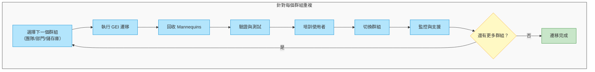

# 遷移至 GitHub Enterprise Managed Users 完整指南 - 第 5 部分：遷移執行

> **📚 系列：遷移至 GitHub Enterprise Managed Users 完整指南**
> 這是 EMU 遷移指南系列的**第 5 部分，共 6 部分**。
>
> | 部分 | 主題 |
> |------|------|
> | [第 1 部分：探索與決策](Part1-Discovery&Decision.md) | 定義目標、評估適用性、取得共識 |
> | [第 2 部分：遷移前準備](Part2-Pre-MigrationPreparation.md) | 盤點、清理、IdP 準備、使用者溝通 |
> | [第 3 部分：身分識別與存取設定](Part3-Identity&Access%20Setup.md) | 設定 SCIM、佈建使用者、建立團隊 |
> | [第 4 部分：安全性與合規性](Part4-Security&Compliance.md) | 稽核記錄、安全強化、CI/CD、整合 |
> | **[第 5 部分：遷移執行](Part5-MigrationExecution.md)**（您在此處）| 執行 GEI、遷移儲存庫 |
> | [第 6 部分：驗證與採用](Part6-Validation&Adoption.md) | 測試、使用者培訓、OSS 策略、正式上線 |

---

# 第 5 階段：遷移執行

*逐群組搬移儲存庫。*

在安全政策就位且使用者已佈建之後，是時候開始遷移了。這個階段是反覆執行的——你需要針對每個團隊或儲存庫群組重複執行。從一個試驗群組開始，從經驗中學習，然後擴展。

## 遷移迴圈



## GitHub 遷移工具

GitHub 提供了多種遷移工具，取決於你的來源平台。

### GitHub Enterprise Importer (GEI)

[GitHub Enterprise Importer](https://docs.github.com/en/migrations/using-github-enterprise-importer/understanding-github-enterprise-importer/about-github-enterprise-importer) 是高保真遷移的主要工具。它支援：

- **Azure DevOps Cloud** 到 GHEC
- **Bitbucket Server/Data Center 5.14+** 到 GHEC
- **GitHub.com** 到 GHEC
- **GitHub Enterprise Server 3.4.1+** 到 GHEC

主要功能：
- 逐儲存庫或逐組織的遷移
- 保留 Git 歷史和 GitHub Metadata（Issues、PRs 等）
- 支援 Dry-Run 遷移用於測試
- 清晰的錯誤記錄，不會因非關鍵問題而阻塞
- 使用者保留其歷史的擁有權

透過 GitHub CLI 安裝和使用 GEI：

```bash
# Install the GEI extension
gh extension install github/gh-gei

# For GHEC to GHEC migration
gh gei migrate-repo \
  --github-source-org SOURCE_ORG \
  --source-repo REPO_NAME \
  --github-target-org TARGET_ORG \
  --target-repo REPO_NAME

# For organization migration
gh gei migrate-org \
  --github-source-org SOURCE_ORG \
  --github-target-org TARGET_ORG \
  --github-target-enterprise TARGET_ENTERPRISE
```

### 處理 Mannequins

當你使用 GEI 遷移時，使用者活動會被連結到稱為「Mannequins」的佔位身分。遷移後，你需要回收這些 Mannequins 並將它們歸屬到真正的 Managed User 帳號。

流程請參閱 [Reclaiming mannequins for GitHub Enterprise Importer](https://docs.github.com/en/migrations/using-github-enterprise-importer/completing-your-migration-with-github-enterprise-importer/reclaiming-mannequins-for-github-enterprise-importer)。

### Dry Runs 和回退計畫

**務必先進行 Dry Run。** GEI 支援 Dry-Run 遷移，可以驗證所有內容而不實際搬移資料：

```bash
# Dry run a repository migration
gh gei migrate-repo \
  --github-source-org SOURCE_ORG \
  --source-repo REPO_NAME \
  --github-target-org TARGET_ORG \
  --target-repo REPO_NAME \
  --dry-run
```

**回退注意事項：**

EMU 遷移沒有簡單的「復原」按鈕。相應地做好計畫：

1. **保持來源環境活躍**：在遷移群組完全驗證且正常運作之前，不要停用來源環境。在過渡期間同時並行運行兩個環境。

2. **設定切換日期，而非不可逆轉的時間點**：使用者可以在你確信新環境準備就緒之前繼續在舊環境中工作。溝通是關鍵。

3. **儲存庫回退**：如果特定儲存庫遷移失敗，你可以重新執行 GEI。來源儲存庫在遷移過程中永遠不會被修改。

4. **使用者回退**：如果 SCIM 造成問題，你可以調整 IdP 群組指派。從 GitHub App 指派中移除使用者會暫停（而非刪除）其帳號。

5. **記錄你的基準**：在開始每個群組的遷移之前，記錄目前狀態，這樣你就知道「正常運作」是什麼樣子。

**真正的安全網是反覆執行**：透過逐群組遷移，問題只影響一個團隊，而非你的整個組織。

---

> **📚 EMU 遷移指南系列導覽**
>
> ⬅️ **上一篇：[第 4 部分 - 安全性與合規性](Part4-Security&Compliance.md)**
> ➡️ **下一篇：[第 6 部分 - 驗證與採用](Part6-Validation&Adoption.md)**
>
> ---
> *這是遷移至 GitHub Enterprise Managed Users 六部分系列的第 5 部分。覺得有幫助？給個 👍 並與你的團隊分享！有問題或我遺漏了什麼？請在下方留言。*
