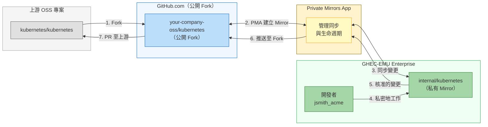

# 遷移至 GitHub Enterprise Managed Users 完整指南 - 第 6 部分：驗證與採用

> **📚 系列：遷移至 GitHub Enterprise Managed Users 完整指南**
> 這是 EMU 遷移指南系列的**第 6 部分，共 6 部分**。
>
> | 部分 | 主題 |
> |------|------|
> | [第 1 部分：探索與決策](Part1-Discovery&Decision.md) | 定義目標、評估適用性、取得共識 |
> | [第 2 部分：遷移前準備](Part2-Pre-MigrationPreparation.md) | 盤點、清理、IdP 準備、使用者溝通 |
> | [第 3 部分：身分識別與存取設定](Part3-Identity&Access%20Setup.md) | 設定 SCIM、佈建使用者、建立團隊 |
> | [第 4 部分：安全性與合規性](Part4-Security&Compliance.md) | 稽核記錄、安全強化、CI/CD、整合 |
> | [第 5 部分：遷移執行](Part5-MigrationExecution.md) | 執行 GEI、遷移儲存庫 |
> | **[第 6 部分：驗證與採用](Part6-Validation&Adoption.md)**（您在此處）| 測試、使用者培訓、OSS 策略、正式上線 |

---

# 第 6 階段：驗證與採用

*針對每個群組進行測試、培訓並正式上線。*

對於你遷移的每個群組，你需要驗證遷移是否成功、培訓使用者，並在過渡期間支援他們。這個階段與第 5 階段同時進行——遷移一個群組、驗證、重複。

## GHEC 到 GHEC-EMU 遷移：秘訣與技巧

如果你是從標準 GHEC 遷移到 EMU，以下是一些來之不易的經驗教訓：

### 1. 你需要一個新的 Enterprise 帳號

**這很關鍵：** 你無法將現有的 GHEC Enterprise 轉換為 EMU。你必須建立一個新的 EMU Enterprise 並遷移至該環境。請聯繫 [GitHub Sales](https://enterprise.github.com/contact) 來啟動此流程。

### 2. 規劃「雙帳號」問題

你那些貢獻開源的開發者需要維護兩個帳號：
- 他們的 Managed User 帳號用於工作
- 個人帳號用於外部貢獻

建立明確的指南說明何時使用哪個帳號。考慮使用不同的瀏覽器或瀏覽器設定檔以避免混淆。

### 3. 處理 GitHub Apps 和整合

許多 GitHub Apps 在 Managed User 帳號下的運作方式不同：
- 安裝在個人帳號上的 Apps 不會轉移
- 某些 Marketplace Apps 可能不支援 EMU
- 內部 Apps 可能需要重新設定

在遷移前稽核你的整合，並聯繫供應商確認 EMU 相容性。

### 4. 保留貢獻歷史

要維持貢獻圖表和歷史：
1. 確保 IdP 中的電子郵件地址與 Git Commits 使用的電子郵件一致
2. 使用 Mannequin 回收流程來歸屬遷移後的歷史
3. 考慮讓使用者驗證他們的電子郵件地址與 IdP 身分一致

### 5. 使用試驗群組進行測試

永遠不要做大爆炸式遷移：
1. 從一個能提供回饋的小型技術團隊開始
2. 遷移幾個儲存庫來測試完整的工作流程
3. 在擴展之前反覆改進你的流程
4. 隨時記錄問題和解決方案

### 6. 時機考量

- **避免季末/年末**：你的財務團隊會感謝你
- **規劃時區覆蓋**：確保各區域都有支援人員
- **緩衝時間**：在估計時間上加 50% 以應對意外問題
- **溝通時段**：考慮全公司範圍的公告

## 使用 EMU 處理開源貢獻

讓我們面對那個顯而易見的問題：EMU 使用者無法貢獻企業外的儲存庫。沒有公開儲存庫、沒有對外部專案的 PRs、沒有為你喜歡的函式庫加星號。對於積極參與開源的組織，這需要一個經過深思熟慮的策略。

### EMU 限制的現實

Managed User 帳號有以下硬性限制：
- **無法**建立公開儲存庫
- **無法**建立 Gists（企業外的公開或私人 Gists）
- **無法**Fork 企業外的儲存庫
- **無法**推送到、評論或與外部儲存庫互動
- **無法**對企業外的任何內容加星號、追蹤或關注
- 對企業外的使用者**不可見**

這不是 Bug 或可以透過設定解決的問題。這是 EMU 安全模型的基本設計。

### 策略 1：雙帳號方式

最常見的解決方案是維護兩個獨立帳號：

```
工作帳號（EMU）：           個人帳號：
jsmith_acme                   jsmith
├── 公司儲存庫             ├── 個人專案  
├── 內部工具            ├── OSS 貢獻
└── 專有程式碼          └── 社群參與
```

**實施提示：**

1. **使用不同的瀏覽器或設定檔**
   - Chrome Profile 1：工作（EMU 帳號）
   - Chrome Profile 2：個人（GitHub.com 帳號）
   - 這可以防止意外提交到錯誤的帳號

2. **按目錄設定 Git 身分**
   ```bash
   # ~/.gitconfig
   [user]
       name = Your Name
       email = personal@email.com
   
   [includeIf "gitdir:~/work/"]
       path = ~/.gitconfig-work
   
   # ~/.gitconfig-work
   [user]
       email = your.name@company.com
   ```

3. **使用 SSH Key 分離**
   ```bash
   # ~/.ssh/config
   Host github.com
       HostName github.com
       User git
       IdentityFile ~/.ssh/id_personal
   
   Host github-work
       HostName github.com
       User git
       IdentityFile ~/.ssh/id_work
   ```

4. **為你的團隊製作文件**，讓每個人都遵循相同的模式

### 策略 2：Private Mirrors App（建議用於 OSS 貢獻）

[Private Mirrors App (PMA)](https://github.com/github-community-projects/private-mirrors) 是一個 GitHub App，旨在解決 EMU 的開源貢獻問題。它是一個內建 EMU 支援的社群專案，為在保持工作私密的同時貢獻上游專案提供了乾淨的工作流程。

**運作方式：**



**PMA 的主要優點：**
- **沒有 Commit 重寫**：保留 Commit 歷史、作者歸屬和 Commit 簽名
- **沒有外部資料庫**：你的程式碼留在 GitHub 上，而非第三方伺服器
- **原生 GitHub 整合**：與現有 GitHub 工作流程和權限搭配使用
- **EMU 相容**：明確支援 Enterprise Managed Users
- **核准工作流程**：確保程式碼在公開之前通過內部審查
- **降低風險**：工作在明確核准上游貢獻之前保持私密

**設定 PMA：**

1. 自行託管 App（Docker 或任何 Next.js 託管供應商）
2. 為你的公開和私有組織設定環境變數：
   ```bash
   PUBLIC_ORG=your-company-oss      # Where public forks live
   PRIVATE_ORG=your-emu-org         # Your EMU enterprise org
   ALLOWED_HANDLES=user1,user2      # Who can create mirrors
   ```
3. 在兩個組織上安裝 GitHub App
4. 開發者即可建立任何上游專案的私有 Mirror

詳細設定說明請參閱 [PMA 文件](https://github.com/github-community-projects/private-mirrors/blob/main/docs/developing.md) 並觀看[示範影片](https://www.youtube.com/watch?v=pVhB0epW5ro)。

**實際案例**：Capital One 在 GitHub Universe 2024 他們的演講 [Contributing with Confidence](https://www.youtube.com/watch?v=boWJs4lASfY) 中分享了使用 PMA 的經驗，展示了他們如何在企業規模下實現安全的開源貢獻。

### 策略 3：手動 Innersource 模式

如果 PMA 不適合你的需求，你可以手動實施類似的工作流程：

1. **使用 Service Account** 或指定的個人帳號在外部 Fork
2. **將 Fork Mirror** 到你的 EMU 企業中作為內部儲存庫
3. **在內部進行變更**，透過正常的 PR 工作流程
4. **從外部 Fork 推送至上游**，使用個人/Service Account

這種方式需要更多手動協調，但避免了額外的工具。

### 策略 4：專責 OSS 團隊或帳號

對於有重大開源存在的公司：

1. **建立一個單獨的非 EMU 組織**，專門用於開源工作
2. **配備擁有個人帳號的開發者**（而非 Managed Users）
3. **建立明確的治理**，規範程式碼可以在 EMU 和 OSS 組織之間如何流動
4. **使用自動化**在環境之間同步核准的變更

這種方式適合以下公司：
- 維護自己的開源專案
- 有專責的開發者關係或 OSS 計畫辦公室
- 需要對其貢獻有公開可見性

### 向開發者溝通此變更

當向習慣貢獻 OSS 的團隊推展 EMU 時，坦誠以待：

1. **承認摩擦** —— 不要假裝這不是一個改變
2. **解釋原因** —— 幫助他們理解安全效益
3. **提供操作手冊** —— 詳細記錄如何處理雙帳號
4. **提供支援** —— 在過渡期間設立答疑時間
5. **收集回饋** —— 某些工作流程可能需要調整

範例溝通：

> 「我們遷移至 Enterprise Managed Users 意味著你的工作 GitHub 帳號將與個人貢獻分開。這保護了我們的程式碼並滿足合規要求。以下是我們有效管理兩個帳號的指南⋯⋯」

### 貢獻圖表怎麼辦？

常見的擔憂：「我的貢獻圖表展示了我的工作！」

使用 EMU 時：
- 工作貢獻會出現在你的 Managed User 個人資料上
- 該個人資料僅在你的企業內可見
- 外部貢獻在你的個人帳號上
- 你的公開個人資料不會顯示工作貢獻

對於在意公開形象的開發者，這意味著要在個人帳號上為 OSS 工作維持活動。在招聘方面，許多公司現在理解這種分離，不會因為企業限制導致的「綠色方塊」較少而對候選人扣分。

## 正式上線驗證檢查清單

遷移後，驗證所有功能是否正常運作：

- [ ] 所有使用者可以透過 IdP 進行身分驗證
- [ ] SCIM Provisioning 正確建立/更新/停用使用者
- [ ] 團隊同步與 IdP 群組正常運作
- [ ] 儲存庫權限正確
- [ ] GitHub Actions Workflows 正常運作
- [ ] 整合和 Webhooks 正常運作
- [ ] 稽核記錄串流已設定
- [ ] 安全政策已強制執行
- [ ] 文件已更新
- [ ] 支援管道已建立

## 停用舊環境

一旦所有群組都已遷移並驗證完成，你可以開始停用來源環境：

1. **設定落日日期**：明確說明舊環境何時將變為唯讀，然後被刪除
2. **封存而非立即刪除**：在永久刪除前封存來源儲存庫 30-90 天
3. **撤銷整合**：從來源環境移除 OAuth Apps、Webhooks 和 GitHub Apps
4. **更新 DNS/書籤**：將任何內部連結重新導向至新企業
5. **通知落後者**：有些使用者會錯過每次溝通。發送最終通知。
6. **記錄經驗教訓**：記錄什麼有效、什麼無效，以及你會做什麼不同的事

---

# 資源與延伸閱讀

### 官方 GitHub 文件
- [Choosing an enterprise type for GitHub Enterprise Cloud](https://docs.github.com/en/enterprise-cloud@latest/admin/identity-and-access-management/understanding-iam-for-enterprises/choosing-an-enterprise-type-for-github-enterprise-cloud)
- [Getting started with Enterprise Managed Users](https://docs.github.com/en/enterprise-cloud@latest/admin/identity-and-access-management/understanding-iam-for-enterprises/getting-started-with-enterprise-managed-users)
- [Planning your migration to GitHub](https://docs.github.com/en/migrations/overview/planning-your-migration-to-github)
- [About GitHub Enterprise Importer](https://docs.github.com/en/migrations/using-github-enterprise-importer/understanding-github-enterprise-importer/about-github-enterprise-importer)
- [Enterprise administrator guides](https://docs.github.com/en/enterprise-cloud@latest/admin/guides)

### 遷移工具
- [GitHub Enterprise Importer CLI](https://github.com/github/gh-gei)
- [gh-repo-stats](https://github.com/mona-actions/gh-repo-stats/) - 儲存庫盤點工具
- [git-sizer](https://github.com/github/git-sizer) - 儲存庫大小分析
- [Private Mirrors App](https://github.com/github-community-projects/private-mirrors) - 從 EMU 企業啟用 OSS 貢獻

### Identity Provider 文件
- [Entra ID: Configure GitHub EMU for automatic provisioning](https://learn.microsoft.com/entra/identity/saas-apps/github-enterprise-managed-user-provisioning-tutorial)
- [Okta: GitHub EMU integration](https://help.okta.com/en-us/content/topics/apps/apps-github-emu.htm)
